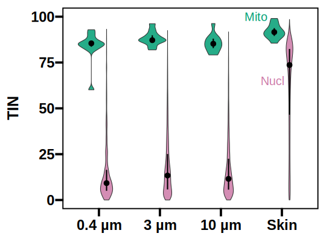

```r
########## Read packages ##########
library(tidyverse)
library(ggplot2)
library(ggrepel)
library(ComplexHeatmap)
library(ggprism)
library(GGally)
library(ggplotify)
library(cowplot)
library(readxl)
library(svglite)

library(Rsubread)
library(edgeR)


########## Read count data ##########
## count data were generated by HTSeq
HTSeq <- read.csv("htseq_all_sample_count_filter.tsv",sep="\t",header=TRUE,row.names=1,stringsAsFactors=F) %>% 
    dplyr::rename(Filter_3_1="X0_eRNA", Filter_3_2="X1_eRNA", Filter_3_3="X2_eRNA", Filter_3_4="X3_eRNA",
                  Filter_04_1="X4_eRNA", Filter_04_2="X5_eRNA", Filter_04_3="X6_eRNA", Filter_04_4="X7_eRNA",
                  Filter_10_1="X8_eRNA", Filter_10_2="X9_eRNA", Filter_10_3="X10_eRNA", Filter_10_4="X11_eRNA",
                  Skin_1="X12_eRNA", Skin_2="X13_eRNA", Skin_3="X14_eRNA", Skin_4="X15_eRNA" )  
tail(HTSeq)

HTSeq <- HTSeq[1:26664,] %>%
  dplyr::select(Filter_04_1,Filter_04_2,Filter_04_3,Filter_04_4,  Filter_3_1,Filter_3_2,Filter_3_3,Filter_3_4,    Filter_10_1,Filter_10_2,Filter_10_3,Filter_10_4,
                Skin_1,Skin_2,Skin_3,Skin_4)


########## Read TIN data ##########
## TIN: Transcript Integrity Number
TIN_raw <- read_xlsx("TIN_summary.xlsx",sheet="gene")   

TIN <- TIN_raw %>%
  mutate(Gene = (str_split_fixed(TIN_raw$geneID,";",n=3))[,3] ) %>%
  group_by(Gene) %>%
  summarize(Filter_3_1 = mean(TIN_0), Filter_3_2= mean(TIN_1), Filter_3_3 = mean(TIN_2), Filter_3_4= mean(TIN_3),
         Filter_04_1 = mean(TIN_4), Filter_04_2 = mean(TIN_5),Filter_04_3 = mean(TIN_6),Filter_04_4 = mean(TIN_7),
         Filter_10_1 = mean(TIN_8), Filter_10_2 = mean(TIN_9),Filter_10_3 = mean(TIN_10),Filter_10_4 = mean(TIN_11),
         Skin_1 = mean(TIN_12), Skin_2 = mean(TIN_13), Skin_3 = mean(TIN_14), Skin_4 = mean(TIN_15) ) %>%
  ungroup() %>% 
  rowwise() %>%
  mutate("3 µm" = mean(c(Filter_3_1,Filter_3_2,Filter_3_3,Filter_3_4)),
         "0.4 µm" = mean(c(Filter_04_1,Filter_04_2,Filter_04_3,Filter_04_4)),
         "10 µm" = mean(c(Filter_10_1,Filter_10_2,Filter_10_3,Filter_10_4)),
         Skin = mean(c(Skin_1,Skin_2,Skin_3,Skin_4)) )　
  
dim(TIN)
```
# [1] 44871    21   

```r


########## Figure 1: TIN distribution in eRNA and skin RNA ##########
mito <- c("gene-ATP6", "gene-COX1", "gene-COX2","gene-COX3","gene-CYTB", "gene-ND1","gene-ND2","gene-ND3","gene-ND4","gene-ND5","gene-ND6" )

Labels <- data.frame(Type=c(3.58,3.85),
                     Mito=c("Mito","Nucl"),Text=c("Mito","Nucl"),y=c(100,65))

Figure_TIN <- TIN %>% 
  pivot_longer(cols="3 µm":Skin, names_to=c("Type"),values_to="TIN") %>% 
  dplyr::select(Gene,Type,TIN) %>%
  mutate(mito = ifelse(Gene %in% mito, "Mito","Nucl")) %>% 
  mutate(Type =factor(Type,levels=c("0.4 µm","3 µm", "10 µm","Skin"))) %>%
  dplyr::filter(! (TIN==0)) %>%     # remove genes with the TIN value of 0
  ggplot() +  
   geom_violin(aes(x=Type,y=TIN,fill=mito),position = position_dodge(width=0.5),alpha=0.85) + 
   stat_summary(aes(x=Type,y=TIN,group=mito),
    fun = "median",fun.min = function(z) { quantile(z,0.25) },fun.max = function(z) { quantile(z,0.75) },
    size = 0.8, linewidth=1, geom = "pointrange", position = position_dodge(width=0.5) )+
   theme_prism(base_size=25,border=TRUE)+
   theme(axis.title.x = element_blank(),
         legend.position = "none",
         strip.text = element_text(hjust = 0.05))+
   scale_y_continuous(limits=c(0,100))+
   labs(y ="TIN") +
   scale_fill_manual(values=c("#009E73", "#CC79A7")) +
   scale_color_manual(values=c("#009E73", "#CC79A7")) +  
   geom_text(data=Labels,aes(x=Type,y=y,label=Text,col=Mito),size=7)


svglite("Figure_1_TIN.svg", width=7.5, height=5.5)
Figure_TIN
dev.off()

```


```r
  
  
#### Statistics for TIN ####
TIN %>% 
  pivot_longer(cols="3 µm":Skin, names_to=c("Type"),values_to="TIN") %>% 
  dplyr::select(Gene,Type,TIN) %>%
  mutate(mito = ifelse(Gene %in% mito, "Mito","Nucl")) %>% 
  mutate(Type =factor(Type,levels=c("0.4 µm","3 µm", "10 µm","Skin"))) %>%
    dplyr::filter(! (TIN==0)) %>%
  group_by(Type,mito) %>%
  summarize( Median = median(TIN), Lower = quantile(TIN, 0.25), Higher=quantile(TIN, 0.75))
```
#  Type   mito  Median Lower Higher
#1 0.4 µm Mito   85.5  83.6    87.0
#2 0.4 µm Nucl    9.22  5.03   16.5
#3 3 µm   Mito   87.2  86.6    89.9
#4 3 µm   Nucl   13.4   5.77   25.1
#5 10 µm  Mito   85.2  82.9    88.0
#6 10 µm  Nucl   11.5   5.66   22.5
#7 Skin   Mito   91.6  89.5    93.8
#8 Skin   Nucl   73.6  46.6    82.4


```r
########## Estimation of the number of detected genes ##########
#### Filtering  ####
Type <-  c(c( rep("Filter small",4),rep("Filter middle",4),rep("Filter large",4) )) %>% as.factor()
Design <- model.matrix(~0+Type)

HTSeq_water <- HTSeq %>% 
  dplyr::select(Filter_04_1,Filter_04_2,Filter_04_3,Filter_04_4,  Filter_3_1,Filter_3_2,Filter_3_3,Filter_3_4,    Filter_10_1,Filter_10_2,Filter_10_3,Filter_10_4)


exp_res_water_04 <- DGEList(counts=HTSeq_water[,1:4], group=Type[1:4], genes=rownames(HTSeq_water))
exp_res_water_3 <- DGEList(counts=HTSeq_water[,5:8], group=Type[5:8], genes=rownames(HTSeq_water))
exp_res_water_10 <- DGEList(counts=HTSeq_water[,9:12], group=Type[9:12], genes=rownames(HTSeq_water))
exp_res_skin <- DGEList(counts=HTSeq[,13:16], group=rep("Skin",4), genes=rownames(HTSeq))
 

## for 0.4 µm filter
keep_04 <- rowSums(cpm(exp_res_water_04) > 10) >= 3    # Retrieve genes with > 10 counts in 3 or more libraries
table(keep_04)  
#note: Chen et al (2016, F1000) recommends that a gene should have a count of at least 10–15 in at least some libraries. 
#FALSE  TRUE 
#25692   972     
exp_res_filtered_04 <- exp_res_water_04[keep_04, , keep.lib.sizes=FALSE] 


## for 3 µm filter
keep_3 <- rowSums(cpm(exp_res_water_3) > 10) >= 3    # Retrieve genes with > 10 counts in 3 or more libraries
table(keep_3)  
#note: Chen et al (2016, F1000) recommends that a gene should have a count of at least 10–15 in at least some libraries. 
#FALSE  TRUE 
#21266  5398   
exp_res_filtered_3 <- exp_res_water_3[keep_3, , keep.lib.sizes=FALSE] 


## for 10 µm filter
keep_10 <- rowSums(cpm(exp_res_water_10) > 10) >= 3    # Retrieve genes with > 10 counts in 3 or more libraries
table(keep_10)  
#note: Chen et al (2016, F1000) recommends that a gene should have a count of at least 10–15 in at least some libraries. 
#FALSE  TRUE 
#21819  4845   
exp_res_filtered_10 <- exp_res_water_10[keep_10, , keep.lib.sizes=FALSE] 


## for skin RNA
keep_skin <- rowSums(cpm(exp_res_skin) > 10) >= 3     # Retrieve genes with > 10 counts in 3 or more libraries
table(keep_skin)  
#note: Chen et al (2016, F1000) recommends that a gene should have a count of at least 10–15 in at least some libraries. 
#FALSE  TRUE 
#17529  9135   
exp_res_filtered_skin <- exp_res_skin[keep_skin, , keep.lib.sizes=FALSE] 


#### Check the overlap of detected genes among sample types  ####
Gene_filter04 <- exp_res_filtered_04$genes[,1]
Gene_filter3 <- exp_res_filtered_3$genes[,1]
Gene_filter10 <- exp_res_filtered_10$genes[,1]
Gene_skin <- exp_res_filtered_skin$genes[,1]

Gene_all <- union(Gene_filter04,Gene_filter3)  %>% union(Gene_filter10) %>% union(Gene_skin) 
Skin_specific <- setdiff(Gene_skin, Gene_filter3) %>% setdiff(Gene_filter04) %>% setdiff(Gene_filter10)  # Genes specifically detected in skin RNA
Gene_skin_and_water <- setdiff(Gene_skin, Skin_specific)  # Genes detected in both skin RNA and eRNA

length(Gene_skin_and_water)
#[1] 5148
  
# write.csv(Gene_filter04,"Gene_filter04.csv")
# write.csv(Gene_filter3,"Gene_filter3.csv")
# write.csv(Gene_filter10,"Gene_filter10.csv")
# write.csv(Gene_skin,"Gene_skin.csv")
# write.csv(Gene_all,"Gene_all.csv")
# write.csv(Skin_specific,"Gene_skin_specific.csv")
# write.csv(Gene_skin_and_water,"Gene_skin_and_water.csv")
```


